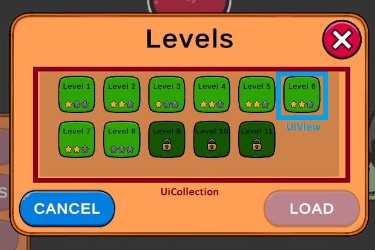

# Kobold UI Plugin Documentation

## Overview
Плагин Kobold UI предоставляет композиционную систему окон поверх Zenject, UniRx и DOTween. Каждый экран интерфейса представлен окном, которое управляет контроллерами и View, а сервисы управляют стеком окон и транслируют события жизненного цикла. Этот документ описывает контракт рантайма, поставляемый с пакетом, и ссылается на реализацию Simple Sample, чтобы показать ожидаемый способ использования.

Структура интерфейса делится на три слоя:

- **Сервисы** управляют стеком окон и предоставляют API для открытия, закрытия и замены экранов.
- **Окна** определяют, какие контроллеры работают внутри Canvas и как запускаются анимации.
- **Контроллеры и View** обрабатывают пользовательские действия и отображают данные, реагируя на обратные вызовы жизненного цикла.

В следующих разделах описаны обязанности каждого слоя и приведены выдержки из Simple Sample, демонстрирующие использование API.

## Window services
`IWindowsService` хранит глобальное состояние всех окон. Плагин предоставляет две специализированные реализации:

- `ILocalWindowsService` работает с Canvas текущей сцены, что подходит для меню.
- `IProjectWindowsService` управляет глобальными окнами, которые переживают смену сцен.

Каждый запрос помещается в очередь, чтобы действия выполнялись последовательно. Открытие или закрытие окна планирует переход, который выполнится после завершения предыдущего действия. Сервисы также предоставляют наблюдаемые значения, показывающие, пуст ли стек и какое окно находится в фокусе.

`OpenWindow` принимает дополнительную политику, которая определяет, что делать с ранее активным окном:

```csharp
_localWindowsService.OpenWindow<MainMenuWindow>(
    onComplete: null,
    previousWindowPolicy: EPreviousWindowPolicy.Default
);
```

Поведение политик:

- `Default` сохраняет текущую логику. Если новое окно — popup, предыдущее переводится в `NonFocused`, иначе — в `Closed`. Предыдущее окно остаётся в навигационном стеке, поэтому `CloseWindow()` сможет вернуться к нему.
- `CloseAndForget` закрывает предыдущее окно (`Closed`) и удаляет его из навигационного стека до открытия нового окна. `CloseWindow()` к нему не вернёт.
- `CloseAfterOpenAndForget` сначала переводит предыдущее окно в `NonFocused`, затем открывает и активирует новое окно, после завершения его открытия закрывает предыдущее окно (`Closed`) и удаляет его из навигационного стека. `CloseWindow()` к нему не вернёт.

В Simple Sample сервис `Bootstrap` ожидает завершения загрузки сцены и открывает главное меню, когда проект готов:

```csharp
public class Bootstrap : IInitializable
{
    private readonly ILocalWindowsService _localWindowsService;
    private readonly IScenesService _scenesService; // ...

    public void Initialize()
    {
        _scenesService.IsLoadingCompleted
            .Subscribe(_ => OpenMainMenu()); // ...
    }

    private void OpenMainMenu()
    {
        _localWindowsService.OpenWindow<MainMenuWindow>(); // ...
    }
}
```

Контроллеры используют тот же сервис, чтобы закрывать активное окно или вернуться к конкретному окну:

```csharp
public class SettingsChangeConfirmationController : AUiController<SettingsChangeConfirmationView>
{
    private readonly ILocalWindowsService _localWindowsService;
    // ...

    public override void Initialize()
    {
        View.yesButton
            .OnClickAsObservable()
            .Subscribe(_ => _localWindowsService.CloseToWindow<MainMenuWindow>()); // ...
        // ...
    }
}
```

## Window lifecycle
Каждое окно реализует `IWindow` и наследуется от `AWindow`. Базовый класс получает `CanvasGroup`, отслеживает внутренние состояния (`Active`, `NonFocused`, `Closed`) и управляет переходами между ними. Колбэки `OnOpen`, `OnClose` и `OnFocusRemoved` передаются контроллерам, чтобы они могли запускать или останавливать анимации, сбрасывать данные или отписываться от сервисов, когда окно покидает стек.

Окно регистрирует свои контроллеры в `AddControllers()`, чтобы фреймворк мог создать их вместе с привязанными View:

```csharp
public class MainMenuWindow : AWindow
{
    [SerializeField] private MainMenuView mainMenuView;
    [SerializeField] private TitleView titleView;

    protected override void AddControllers()
    {
        AddController<MainMenuController, MainMenuView>(mainMenuView); // Контроллер кнопок навигации
        AddController<TitleController, TitleView>(titleView); // Контроллер анимированного заголовка
    }
}
```

## Controllers
Контроллеры наследуются от `AUiController<TView>`. Они получают сервисы через конструктор и переопределяют `Initialize()`, чтобы подписаться на наблюдаемые значения, предоставляемые View. При необходимости контроллеры переопределяют методы жизненного цикла и сбрасывают состояние, когда окно открывается повторно.

Контроллер главного меню показывает, как пробрасывать клики в сервис окон:

```csharp
public class MainMenuController : AUiController<MainMenuView>
{
    private readonly ILocalWindowsService _localWindowsService;
    // ...

    public override void Initialize()
    {
        View.startButton
            .OnClickAsObservable()
            .Subscribe(_ => _localWindowsService.OpenWindow<LevelSelectorWindow>());
        // ... обрабатываем остальные кнопки
    }
}
```

Другие контроллеры реагируют на данные сервисов и обновляют View:

```csharp
public class LoadingIndicatorController : AUiController<LoadingIndicatorView>
{
    private readonly IScenesService _levelsService; // ...

    public override void Initialize()
    {
        _levelsService.LoadingProgress
            .Subscribe(progress => View.loadingProgressText.text = Format(progress))
            .AddTo(View); // ...
    }

    private string Format(float progress) => $"{progress * 100f:0}%"; // ...
}
```

Состояние контроллера настроек показывает работу с пользовательским вводом и подтверждением закрытия:

```csharp
public class SettingsController : AUiController<SettingsView>
{
    private readonly ReactiveProperty<bool> _wasSomethingChanged = new();
    // ... включает сервис хранения и ILocalWindowsService

    public override void Initialize()
    {
        View.applyButton.OnClickAsObservable().Subscribe(_ => Apply()).AddTo(View);
        View.closeButton.OnClickAsObservable().Subscribe(_ => HandleClose()).AddTo(View);
        _wasSomethingChanged.Subscribe(OnSomethingChanged).AddTo(View); // ...
    }

    private void HandleClose()
    {
        if (_wasSomethingChanged.Value)
            _localWindowsService.OpenWindow<SettingsChangeConfirmationWindow>();
        else
            _localWindowsService.CloseWindow();
    }

    private void Apply() => _settingsStorageService.ApplyUnsavedSettings(); // ...
    // ...
}
```

## Views
View наследуются от вариаций `AUiView`, которые определяют реакцию GameObject на события жизненного цикла. `AUiAnimatedView` оставляет иерархию активной во время анимаций, `AUiSimpleView` включает и отключает корневой объект, а коллекционные View наследуются от `AUiSimpleCollectionView`, чтобы работать в составе пулов.

View настроек содержит компоненты Unity UI, которыми управляет контроллер:

```csharp
public class SettingsView : AUiAnimatedView
{
    public Slider soundVolume; // ...
    public Button closeButton;
}
```

Элемент коллекции хранит ссылки на элементы оформления и состояния выбора:

```csharp
public class LevelItemView : AUiSimpleCollectionView
{
    [SerializeField] private Button button; // ...
    public IObservable<Unit> OnClick => button.OnClickAsObservable();
    public LevelData Data { get; private set; }
    // ...
}
```

## Animations
Анимации интерфейса наследуются от `AUiAnimationBase` или управляются напрямую внутри контроллеров. В Simple Sample DOTween анимирует заголовок при открытии главного меню и останавливает анимацию при закрытии окна.

```csharp
public class TitleController : AUiController<TitleView>
{
    protected override void OnOpen()
    {
        View.container
            .DOPunchScale(View.scalePunch, View.duration)
            .SetLoops(-1)
            .SetLink(View.gameObject); // ...
    }
    // ...
}
```

## Collections
Коллекционные контроллеры наследуются от реализаций `AUiCollection<TView>`, создают элементы из пула и управляют их жизненным циклом. Перед заполнением список очищается, а состояние выбора обновляется вручную.

```csharp
public class LevelSelectorController : AUiController<LevelSelectorView>
{
    private LevelItemView _selectedItem; // ...
    private readonly ILevelProgressionService _levelProgressionService; // ...

    public override void Initialize()
    {
        foreach (var levelData in _levelProgressionService.Progression)
        {
            var item = View.levelItemsCollection.Create();
            item.SetLevelData(levelData);
            item.OnClick.Subscribe(_ => OnItemClicked(item));
        }
    }

    private void OnItemClicked(LevelItemView item)
    {
        if (!item.Data.IsUnlocked)
            return;

        _selectedItem?.SetSelectionState(false); // ...
        item.SetSelectionState(true);
        _selectedItem = item;
    }
}
```



## Installers and bindings
Инсталлеры оборачивают префабы окон и Canvas, чтобы Zenject мог создать их в рантайме. Используйте `DiContainerExtensions.BindWindowFromPrefab`, чтобы зарегистрировать окно на нужном Canvas. Сценовые инсталлеры обычно настраивают локальный интерфейс, а проектные — глобальные окна.

```csharp
[CreateAssetMenu(...)]
public class MainMenuUiInstaller : ScriptableObjectInstaller
{
    [SerializeField] private Canvas canvas; // ...
    [SerializeField] private MainMenuWindow mainMenuWindow;

    public override void InstallBindings()
    {
        var canvasInstance = Instantiate(canvas); // ...
        Container.BindWindowFromPrefab(canvasInstance, mainMenuWindow);
        Container.BindInterfacesTo<Bootstrap>().AsSingle();
    }
}
```

Проектный инсталлер сохраняет общие Canvas между сменами сцен:

```csharp
[CreateAssetMenu(...)]
public class ProjectUiInstaller : ScriptableObjectInstaller
{
    [SerializeField] private Canvas canvas; // ...
    [SerializeField] private LoadingWindow loadingWindow;

    public override void InstallBindings()
    {
        var canvasInstance = Instantiate(canvas); // ...
        DontDestroyOnLoad(canvasInstance);
        Container.BindWindowFromPrefab(canvasInstance, loadingWindow);
    }
}
```

Эти примеры показывают, как Simple Sample объединяет строительные блоки плагина. Комбинируйте сервисы, окна, контроллеры и инсталлеры, чтобы расширять стек интерфейса собственными окнами, сохраняя единый жизненный цикл.
