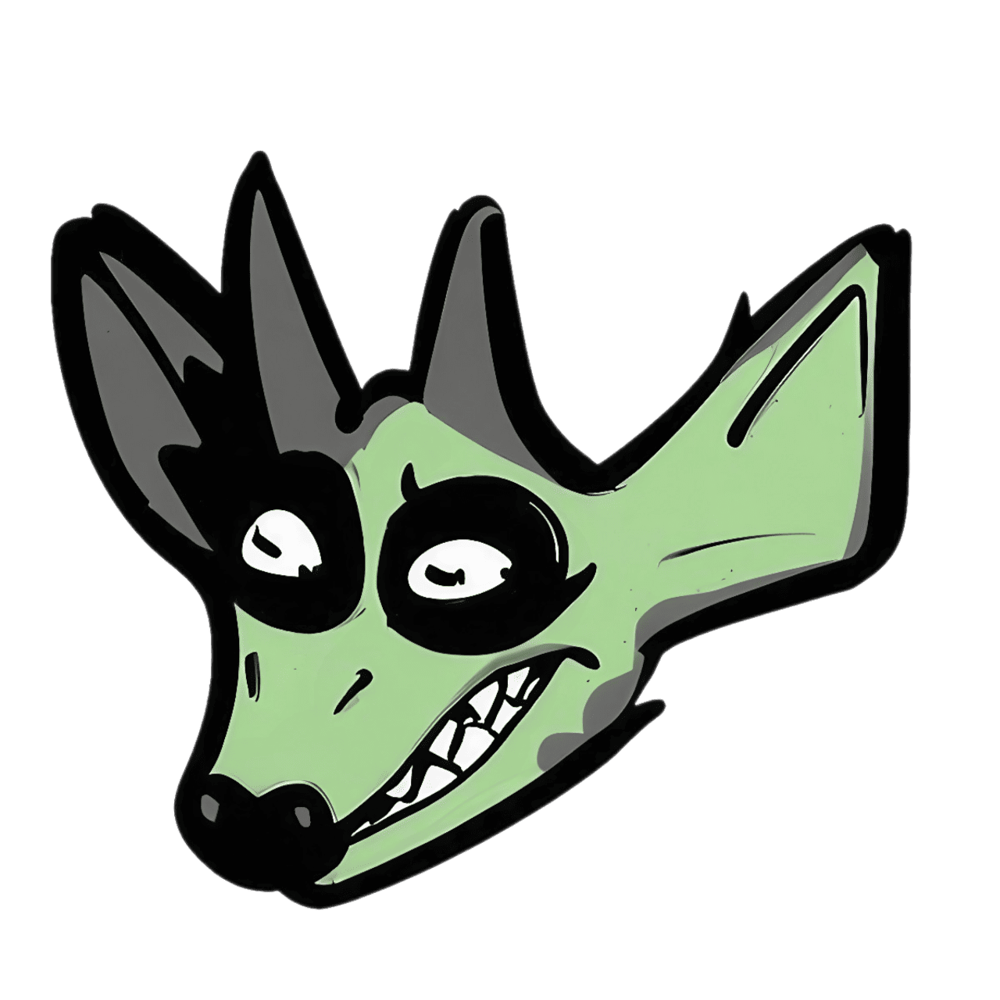
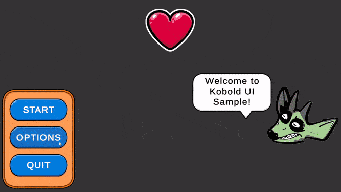

<div align="center" valign="middle" style="page-break-after: always;">
<br>
    <h1>Kobold UI</h1>
    
    <h2>uGUI framework for Unity</h2>
    <br>
</div>

# Dependencies
- **Zenject** – a package for dependency injection
  * [https://github.com/modesttree/Zenject](https://github.com/modesttree/Zenject)
- **Unitask** – a package for more efficient and convenient async/await handling in Unity
  * [https://github.com/Cysharp/UniTask](https://github.com/Cysharp/UniTask)
- **Dotween** – a plugin for tween animations
  * [https://dotween.demigiant.com](https://dotween.demigiant.com/getstarted.php)
- **Alchemy** (optional) – extensions for the inspector
  * [https://github.com/AnnulusGames/Alchemy](https://github.com/AnnulusGames/Alchemy)


# Installation
1. Install all dependencies.
2. Generate the `.asmdef` for **Dotween**:
`Tools -> Demigiant -> DOTween Utility Panel -> Create .asmdef`
3. Add the define to:`Edit -> Project Settings -> Player -> Scripting Define Symbols`
```
UNITASK_DOTWEEN_SUPPORT
```
4. If you installed **Alchemy**, also add the define:
```
KOBOLD_ALCHEMY_SUPPORT
```
5. Install the plugin via Git: 
```
https://github.com/KienanUnique/KoboldUiFramework.git
```


# Useful Links
- [Documentation (En)](https://github.com/KienanUnique/KoboldUiFramework/blob/main/Documentation~/DocumentationEn.md)
- [Documentation (Ru)](https://github.com/KienanUnique/KoboldUiFramework/blob/main/Documentation~/DocumentationRu.md)

<div align="center" valign="middle" style="page-break-after: always;">
<br>
    
<br>
</div>